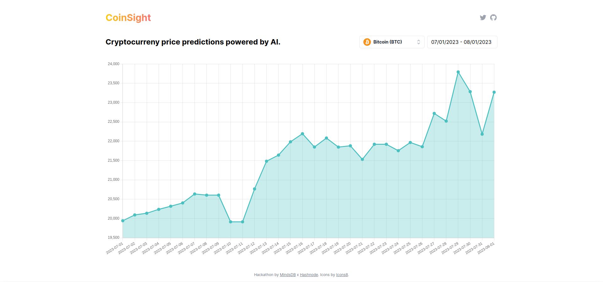

# CoinSight


[](https://github.com/VladimirMikulic/route-list/actions)
[](https://twitter.com/VladoDev)

> ✨ Cryptocurrency price predictions powered by AI.



## 📦 Development

1. Please create [free](https://cloud.mindsdb.com) MindDB account and then use those credentials to create `.env` file:

```sh
MINDSDB_USERNAME="MindsDB Account Email"
MINDSDB_PASSWORD="MindsDB Account Password"
```

3. Upload sample CSV files from `data` folder within this repo to MindsDB Cloud
4. Run the following snippet to train model for each currency

```sql
CREATE PREDICTOR {{currency}}_predictor
FROM files
(SELECT * FROM {{currency}})
PREDICT price
```

5. Install dependencies (`yarn install`)
6. Start development server (`yarn dev`)

## 👨 Author

**Vladimir Mikulic**

- Twitter: [@VladoDev](https://twitter.com/VladoDev)
- Github: [@VladimirMikulic](https://github.com/VladimirMikulic)
- LinkedIn: [@vladimirmikulic](https://www.linkedin.com/in/vladimir-mikulic/)

## 🤝 Contributing

Contributions, issues and feature requests are welcome!

## 🍻 Credits

Predictions powered by [MindsDB](https://mindsdb.com).

## ✏️ License

This project is licensed under [MIT](https://opensource.org/licenses/MIT) license.

## 👨‍🚀 Show your support

Give a ⭐️ if this project helped you!
